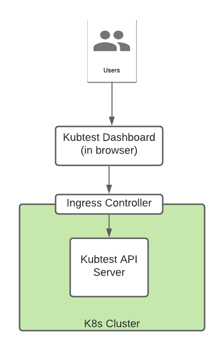
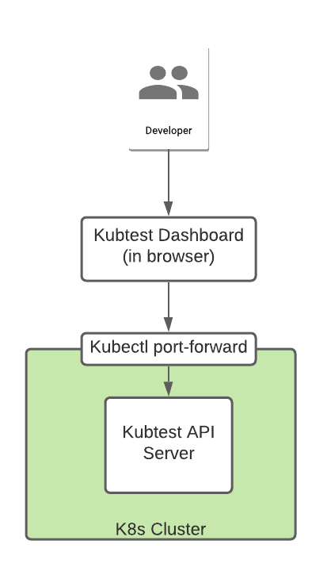

# Kubtest Dashboard 

A simple read-only dashboard for real-time Kubtest results.

The Kubtest Dashboard is deployed as a standalone web application in a cluster running Kubtest. It communicates
with the Kubtest api-server via an Ingress controller (either provided or bundled):



## Development setup

During development one can bypass the Ingress and interact with the api-server directly:

- Install Kubtest in your cluster - see [Kubtest Installation](https://kubeshop.github.io/kubtest/installing/) 
- Expose the api-server with 

```shell  
➜  ~ kubectl port-forward service/kubtest-api-server 9090:8080 --namespace kubtest
Forwarding from 127.0.0.1:9090 -> 8080
Forwarding from [::1]:9090 -> 8080
```

(here we're exposing the kubtest-api-server running in the kubtest namespace on port 9090 locally)



## Packaging / Running under Docker

Package this into a Docker image using the provided [Dockerfile](Dockerfile) with

```
docker build -t kubeshop/kubtest-dashboard .    
```

Run locally on port 3001 with

```
docker run -it -p 3001:80 kubeshop/kubtest-dashboard:latest      
```

## Deploying under Kubernetes

Push to DockerHub

```
docker push kubeshop/kubtest-dashboard    
```

Deploy the included manifest to your cluster:

```
kubectl apply -f manifests/deployment.yaml
```

Access using port-forwarding :

```
kubectl port-forward service/kubtest-dashboard 8080:8001
```

(this example forwards on port 8080)

## Building

This project was bootstrapped with [Create React App](https://github.com/facebook/create-react-app), using the [Redux](https://redux.js.org/) and [Redux Toolkit](https://redux-toolkit.js.org/) template.

Eslint/Prettier/Husky/Craco/etc configuration was copied from [Monokle](https://github.com/kubeshop/monokle) project 

## Available Scripts

In the project directory, you can run:

### `npm run start`

Runs the app in the development mode.<br />
Open [http://localhost:3000](http://localhost:3000) to view it in the browser.

The page will reload if you make edits.<br />
You will also see any lint errors in the console.

### `npm run test`

Launches the test runner in the interactive watch mode.<br />
See the section about [running tests](https://facebook.github.io/create-react-app/docs/running-tests) for more information.

### `npm run build`

Builds the app for production to the `build` folder.<br />
It correctly bundles React in production mode and optimizes the build for the best performance.

The build is minified and the filenames include the hashes.<br />
Your app is ready to be deployed!

See the section about [deployment](https://facebook.github.io/create-react-app/docs/deployment) for more information.

## Learn More

You can learn more in the [Create React App documentation](https://facebook.github.io/create-react-app/docs/getting-started).

To learn React, check out the [React documentation](https://reactjs.org/).
